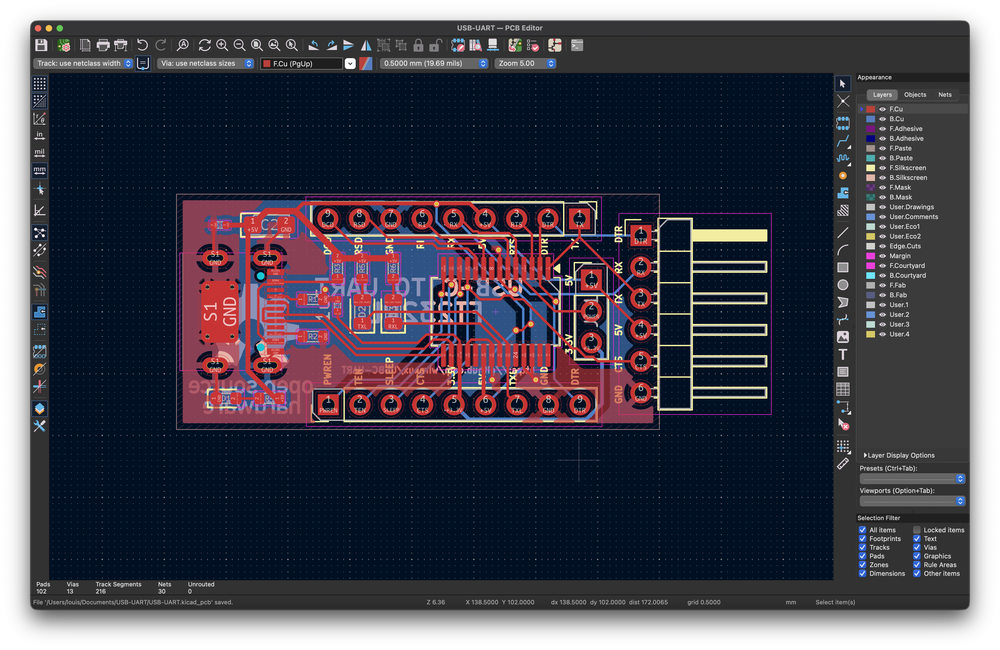
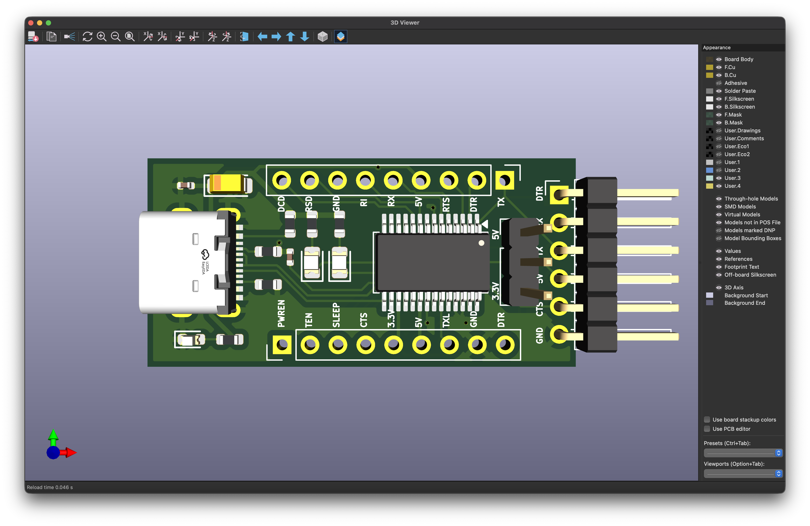
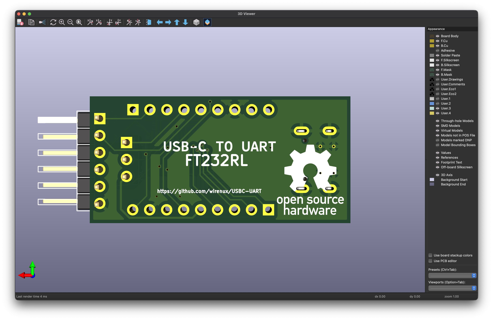
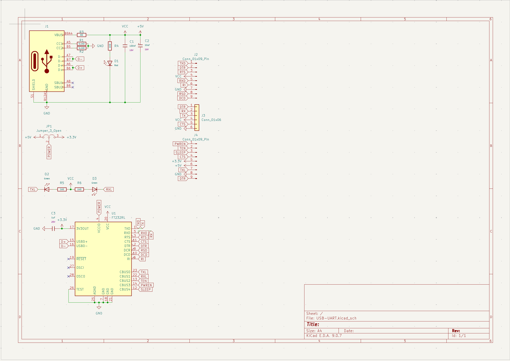

# USB-C to UART Bridge

A simple project to convert a traditional USB-B UART bridge schematic to a modern **USB-C** interface.

---

## PCB & 3D

## CC Resistors

For the device to work with **USB-C to USB-C cables**, you must add two resistors to the configuration pins:

* **CC1 (Pin A5):** Connect a **5.1kΩ** resistor to **GND**.
* **CC2 (Pin B5):** Connect a **5.1kΩ** resistor to **GND**.

---

## Schematic

---

## 📜 License

This project is under [MIT](./LICENSE) license.
